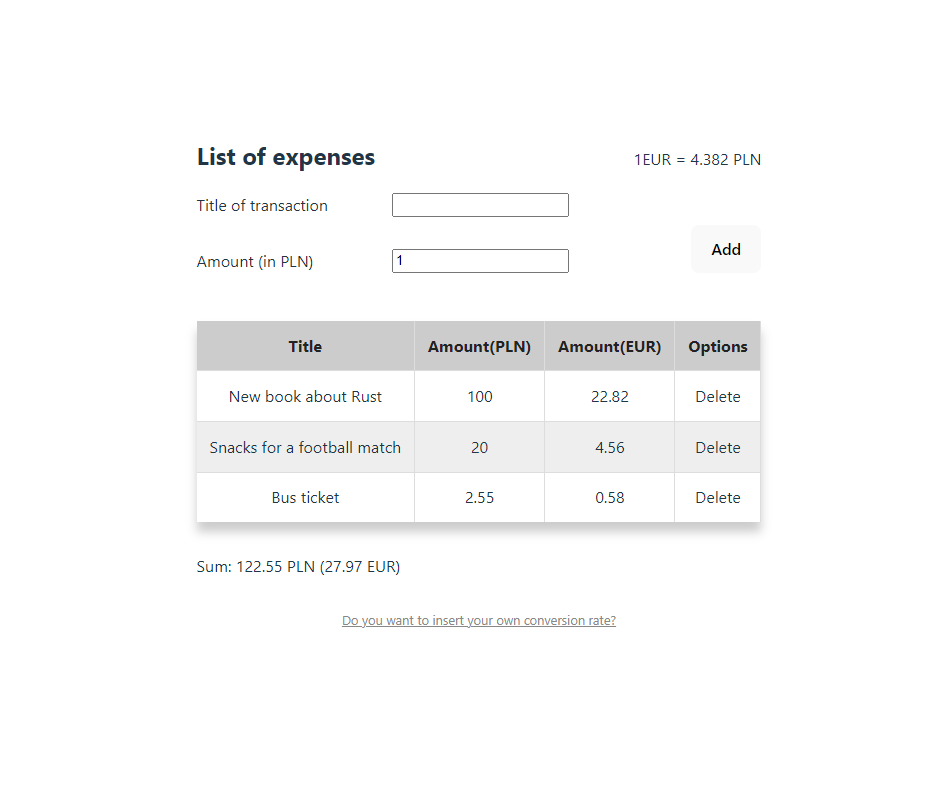

# Playbook Engineering recruitment task

## Screenshots: 📷

## How to start the project 💻

- `git clone` clone repo
- `yarn` install dependencies
- `yarn dev` start project

## Technologies Used: ☕️ 🐍 ⚛️

Techstack used in the project:

- Vite
- React
- Typescript

Other useful technologies for the project (not used): 📚

- Zod for validating user input
- Tanstack-Table for creating tables with great DE
- some kind of API for updating currencies convertion rates
- some kind of state management tool like Context, Redux or MobX - I didn't found that necessary for the project, so I ommited usage of those
- React-Query for API calls

## Possible improvements 📝

- debouncing user input for changing convertion rates
- memoizing previous PLN and EUR amounts for less calculations
- ability to update table items
- memoizing sum of amounts
- better user input handling (probably with Zod)
- app should be splitted in multiple small, reusable components, but I kept it in single file for simplicity
- I would probably use some kind of CSS-in-JS kile Tailwind or styled-components, but I think plain css is more than enough for this project, I could've also done it with css module for each component
- we could also add other currencies input, then splitting the code into multiple components would've made sense
